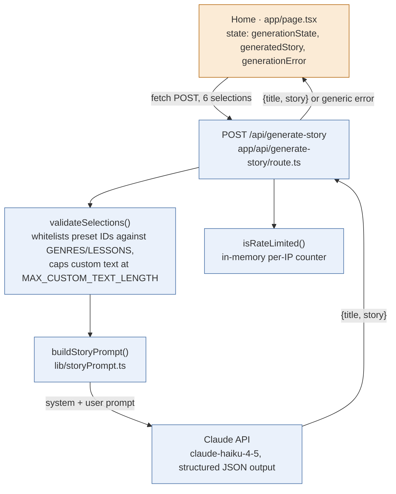
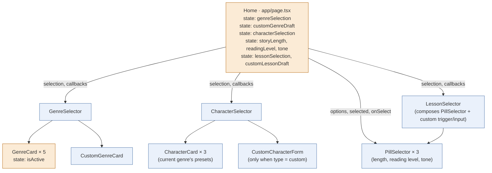

# Architecture

**Last updated:** 2026-07-21 21:38

Technical design supporting [PRD.md](PRD.md). Stack decision itself lives in [persona/CTO.md](../persona/CTO.md#tech-stack); this doc covers how the pieces fit together and evolves as we build.

## Technical Considerations

- **Story generation & safety**: use a system prompt that constrains tone/content for a young audience, plus a lightweight keyword/pattern filter on custom character input as defense-in-depth (don't rely solely on the model's own judgment for a kids' product).
- **Streaming for Day 2 chat**: recommend the Vercel AI SDK (`ai` package) with its Anthropic provider - it's built for exactly this (streaming chat UI in Next.js) and comes from the same vendor as hosting, which keeps integration friction low.
- **Data model (Day 2, Supabase/Postgres)**:
  - `characters` - id, user_id, name, traits, appearance, created_at
  - `stories` - id, user_id, character_id, genre, content, created_at
  - `conversations` - id, character_id, messages (jsonb), created_at
  - Auth/users handled by Supabase's built-in `auth.users` - don't build a custom users table unless a real need shows up.
- **Cost/rate limiting**: a basic in-memory per-IP limiter (5 requests/min) ships with #13 as a stopgap against naive scripts - it's not real abuse defense (the `x-forwarded-for` key it reads is client-spoofable, and it doesn't share state across serverless instances). Real rate-limiting infra is still needed before this is shared beyond just us.
- **Environment separation**: `.env.local` for local dev (gitignored, already set up), Vercel project environment variables for production - never share a single key across both carelessly.
- **Ads vs. children's privacy (Later phase)**: see the flagged NFR in PRD.md - this needs a real decision before F17 is built, not before Day 1/2.
- **Future native iOS/Android (post-web goal)**: no stack change needed now. Next.js API routes are plain HTTP endpoints, so a future Expo (React Native) app can call the exact same backend and Supabase project as-is - no backend rewrite. Supabase has an official React Native SDK, so Day 2 auth patterns carry over too. The UI layer (Tailwind) won't port directly to React Native and will need rebuilding per platform when that phase starts - normal and expected, not a problem to solve now. The one practice worth adopting from the start, at no extra cost: keep data-fetching/business logic in separate hooks/modules rather than embedded inside page components, so that logic (not just the backend) is reusable later too.

## Architecture Overview

### Day 1 (stateless)
```
Client (Next.js, mobile-first)
  -> selects genre, character, length, reading level, tone, lesson
  -> POST /api/generate-story                        [built - #13]
       -> server-side call to Claude API (Haiku)      [built - #13]
       -> content-safety check on output              [not yet built - #16]
  <- {title, story} returned, rendered client-side (bare/placeholder - #20 owns the real reading UI)
```
No database, no auth. Everything lives in the request/response cycle.

#### Code map: story generation (#13)



`lib/storyOptions.ts`'s `MAX_CUSTOM_TEXT_LENGTH` (300 chars) is shared between the route's server-side validation and `maxLength` on the custom genre/character/lesson inputs, so client and server never drift on this limit.

This is a snapshot of the code as of issue #13 — re-diagram when #16 (content-safety layer) or #20 (real reading UI) change this flow.

#### Code map: setup screen — Genre & Character Selection (#4) + Story Customization Selectors (#8, #31)

Component tree — who renders whom. Amber = holds its own state (`useState`); blue = stateless/display-only.



Data model (`lib/types.ts`) — TypeScript `type`s, not classes, but this is the closest thing to a class diagram this codebase has:

```mermaid
classDiagram
  class Genre {
    id: string
    label: string
    icon: string
    blurb: string
    characters: PresetCharacter[3]
  }
  class PresetCharacter {
    id: string
    name: string
    description: string
  }
  class GenreSelection {
    <<union>>
  }
  class Preset_Genre {
    type: "preset"
    genreId: string
  }
  class Custom_Genre {
    type: "custom"
    text: string
  }
  class SelectedCharacter {
    <<union>>
  }
  class Preset_Character_Ref {
    type: "preset"
    characterId: string
  }
  class CustomCharacter {
    type: "custom"
    name: string
    traits: string
    description: string
  }

  Genre "1" *-- "3" PresetCharacter : characters
  GenreSelection <|-- Preset_Genre
  GenreSelection <|-- Custom_Genre
  SelectedCharacter <|-- Preset_Character_Ref
  SelectedCharacter <|-- CustomCharacter

  class PillOption~T~ {
    id: T
    label: string
  }
  class StoryLength {
    <<union>>
    "quick" | "longer"
  }
  class ReadingLevel {
    <<union>>
    "toddler" | "early-reader" | "independent-reader"
  }
  class Tone {
    <<union>>
    "funny" | "calming" | "exciting" | "heartwarming"
  }
  class Lesson {
    <<union>>
    "kindness" | "courage" | "sharing" | "honesty" | "perseverance"
  }
  class LessonSelection {
    <<union>>
  }
  class Preset_Lesson {
    type: "preset"
    lessonId: Lesson
  }
  class Custom_Lesson {
    type: "custom"
    text: string
  }

  LessonSelection <|-- Preset_Lesson
  LessonSelection <|-- Custom_Lesson
```



`GENRES` in `lib/genres.ts` is the actual instance data: 5 hardcoded `Genre` objects, each with 3 `PresetCharacter`s (15 total). `lib/storyOptions.ts` holds the same role for the #8/#31 selectors: a `PillOption<T>[]` list + a `DEFAULT_*` constant per union type above (`LESSONS`/`DEFAULT_LESSON` cover the `Lesson` presets that `LessonSelection`'s preset variant wraps).

This is a snapshot of the code as of issue #4, #8, and #31 — it'll go stale as new screens are added; re-diagram if it's no longer trustworthy rather than trusting it blindly.

### Day 2 additions
```
Supabase Auth -> login/signup, session
Client -> authenticated API routes
  -> /api/characters (CRUD, saved to Postgres)
  -> /api/stories (CRUD, saved to Postgres)
  -> /api/chat (streaming, Vercel AI SDK + Claude, appends to conversations table)
```
Existing Day 1 generation flow is reused for the initial story; the conversation table extends it rather than replacing it.

### Later
- Image/video generation: separate API route calling an external provider (e.g. Replicate/fal.ai), decided when this phase starts.
- TTS/STT: separate integration point (e.g. ElevenLabs for TTS, browser Web Speech API or Whisper for STT), decided when this phase starts.
- Payments: Stripe, with webhook handling for subscription state; ties into the usage-cap logic from F18.

### Hosting
- Vercel: Next.js app + API routes.
- Supabase: managed Postgres + Auth (Day 2+).
- All secrets via environment variables (`.env.local` locally, Vercel project settings in production) - never committed.
