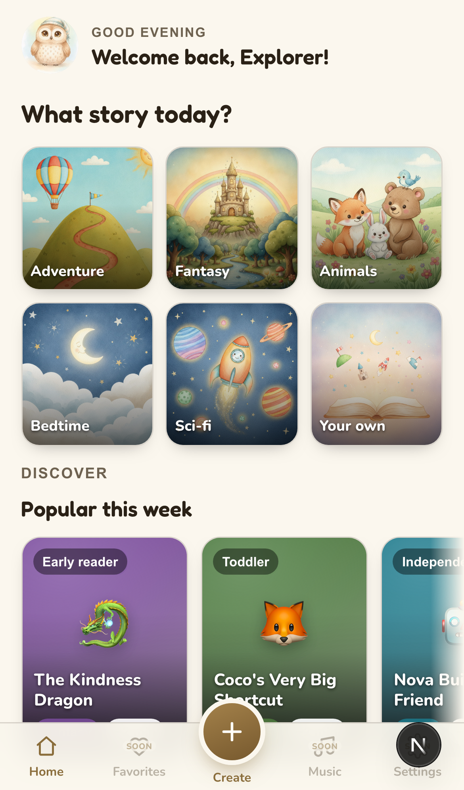
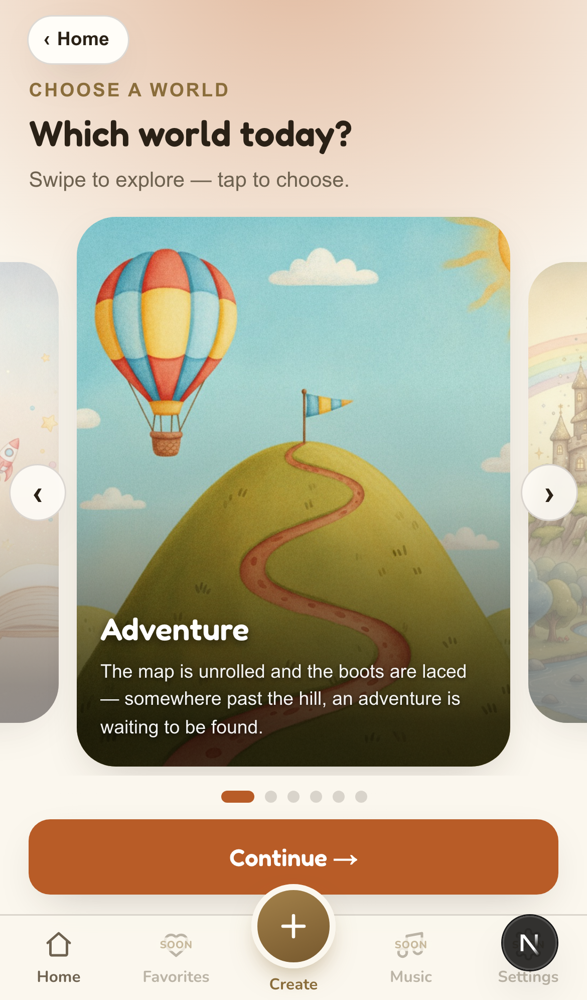
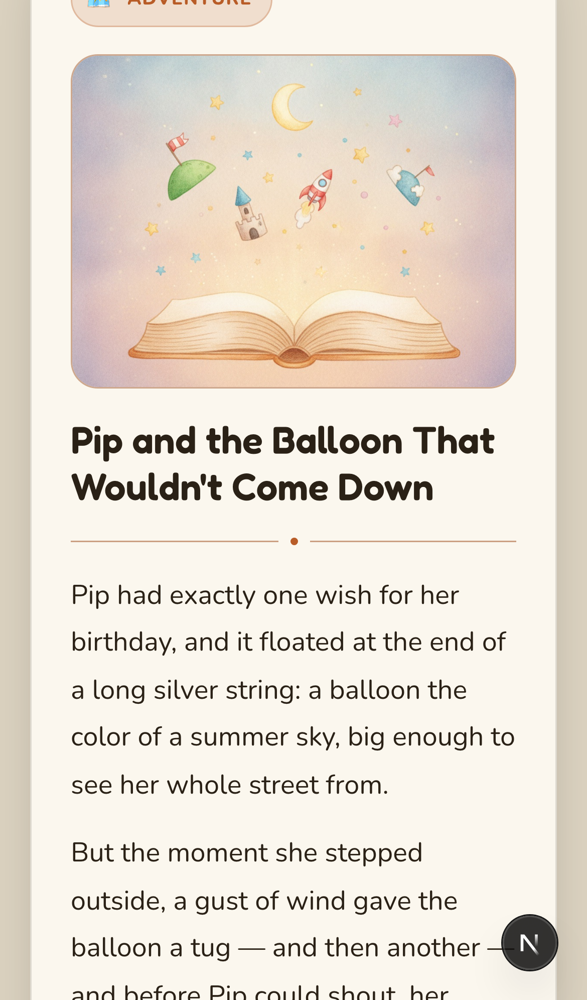
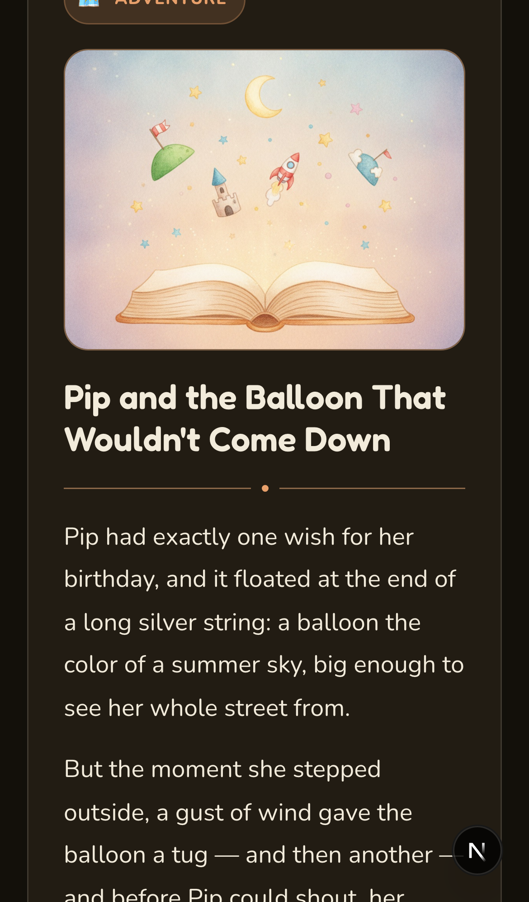
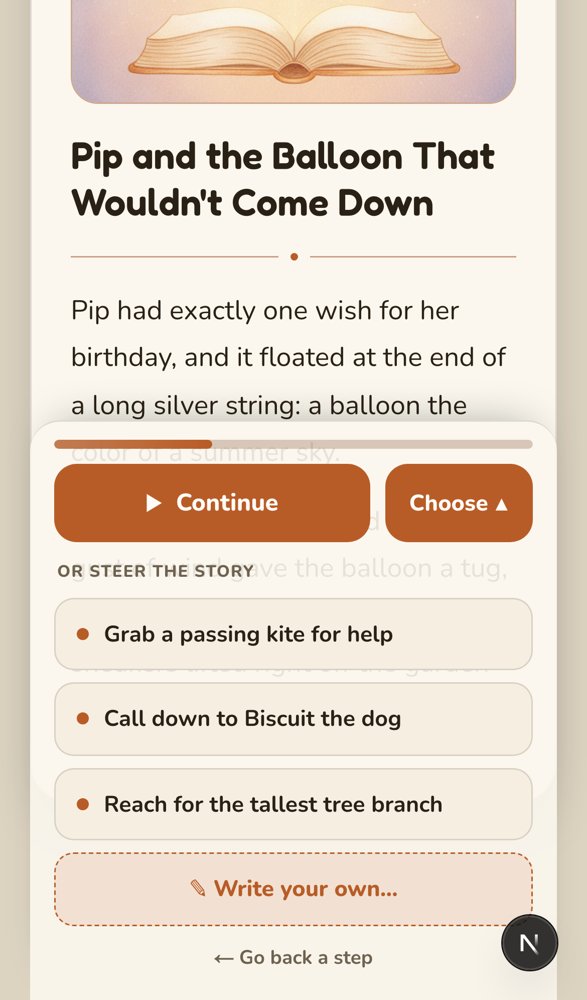
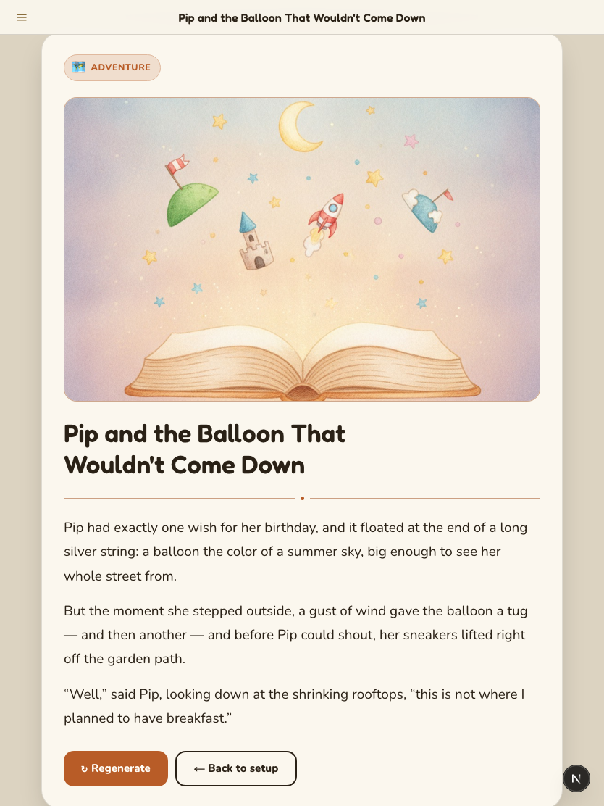

# v2.0.0 — Interactive, illustrated, mobile-native

**Shipped:** 2026-08-10 · **Built:** 2026-07-23 → 2026-08-10 (~18 days) · [Release notes](https://github.com/aio-studios/children-story-app/releases/tag/v2.0.0) · [Live app](https://children-story-app-lac.vercel.app/)

A product-manager's-eye retrospective on the second generation of Storykins — how a one-shot story *generator* became an interactive, illustrated, mobile-native storytelling *app*. Written from the actual issue history, design-decision docs, and review findings, not reconstructed after the fact. (For v1, see [v1.0.0.md](v1.0.0.md).)

## Overview

v1.0.0 answered one question: does picking a few things and getting a genuinely good story back feel worth doing? It did. v2.0.0 is what you build once the core loop is proven — it widens the product on three axes at once:

- **Interaction** — the story stopped being one-shot. You now steer it beat by beat.
- **Craft** — emoji placeholders became real, per-story AI illustrations and hand-illustrated art.
- **Reach** — the whole UI was rebuilt mobile-native and made to read well on phone, landscape, and tablet.

Still deliberately **stateless** (no accounts) — that line held from v1 on purpose. The bet for v2 wasn't "add persistence," it was "make the thing you already have feel like a real, delightful app before asking anyone to sign up for it."

## 1. From v1 to v2 — the strategic shift

The operating model carried over unchanged (Claude Code as CTO/developer, PM-directed, the 9-stage workflow, skipped steps called out — see the [v1 case study §1](v1.0.0.md)). What changed was the *bar*. v1 optimized for fastest-path-to-real. v2 explicitly optimized for **portfolio-grade craft**, which showed up as two new standing rules added to the workflow:

- **Design research before build for any multi-screen change** — for a new information architecture, look at how comparable products solve the same structural problem and sketch *several* genuinely different wireframe iterations to debate, not one polished preview to rubber-stamp.
- **Playwright-based mock/UI QA** — preview mockups and the live app are both driven headlessly (click, toggle light/dark, open menus, screenshot) so visual and interaction bugs are caught before UAT, not during it.

Both came directly from friction felt in v1, and both are why the design section below is the longest part of this story.

## 2. Discovery & Requirements

No new PRD was written — v2 draws on the "Future Ideas" backlog that was already in `docs/PRD.md` on day one of v1. The three big bets were chosen from it deliberately:

| Bet | Why now | Persona it serves |
|---|---|---|
| **Interactive branching** (#37) | The single most-requested idea in the original backlog; it's the thing that separates "a generator" from "an experience" | The Inquisitive Parent + Curious Child — agency, not just output |
| **Illustrations** (#38, #59) | A kids' story product with emoji placeholders doesn't read as finished; visual craft is table stakes for the audience | The Curious Child — the actual reader |
| **Mobile-native UI** (#61/#73/#79) | It's a mobile web app; v1's UI was functional but read as "a website," not "an app" | Everyone — this is the ambient quality bar |

The v1 scope line held: **setup stays parent-operated; only the reading experience must work for a child.** Interactive branching tested that line and it survived — steering controls are adult-facing chrome around a child-facing reading surface.

**One honest open item:** the product still doesn't have a final name. "Storykins" is a working title; alternatives are tracked in [#68](https://github.com/aio-studios/children-story-app/issues/68) rather than blocking the build. Naming a consumer product is a real decision, and forcing it early to feel "done" would have been the wrong call.

## 3. Planning & Backlog

v2 wasn't one epic — it was two tracks that interleaved:

- **Feature work** shipped incrementally as standalone issues (illustrations #38/#59, interactive mode #37, rate-limiter hardening #39/#46/#47, legibility #60) — each its own plan doc, review, and UAT.
- **The UI redesign** was scoped as a single epic, [#76 — V2 UI: mobile-native polish, navigation & orientation](https://github.com/aio-studios/children-story-app/issues/76), and deliberately **designed all at once but built as one coherent batch** (nav → home → setup) so the three screens shared one visual language instead of drifting.

Deferred-not-lost discipline held: a two-page **book-mode reader with page-flip** was explicitly pushed to [#77](https://github.com/aio-studios/children-story-app/issues/77) rather than scope-creeping into the iPad work, and future content ideas (a classics library, multi-language, songs) were filed as [#69–#71](https://github.com/aio-studios/children-story-app/issues/69) instead of debated mid-build.

## 4. Design

This is where v2 spent its craft budget. The redesign touched three screens and a new navigation system — exactly the "multi-screen, new IA" case the new design-research rule was written for. So each screen went through **3-way wireframe comparisons before a direction was picked**, then a **responsive mock (phone / landscape / tablet, light + dark) approved before any implementation** — all captured in [`docs/designs/v2-redesign-decisions.md`](../designs/v2-redesign-decisions.md) and a dozen live Artifact mockups saved into `docs/designs/`.

The chosen directions, and *why*:

- **Setup → "Immersive deck"** ([#79](https://github.com/aio-studios/children-story-app/issues/79)) — replace the multi-step Back/Next stepper with a swipeable, full-bleed card deck where the whole screen tints to the focused world. Most app-native of the three options; the one risk (is horizontal swipe discoverable?) was mitigated by adding a peek of the next card + subtle arrows *in the design*, before build.
- **Navigation → "Bottom bar + Create"** ([#73](https://github.com/aio-studios/children-story-app/issues/73), landscape [#75](https://github.com/aio-studios/children-story-app/issues/75)) — one nav model, three shapes: bottom bar (phone) → icon rail (landscape) → collapsible sidebar (tablet), with Create — the app's whole purpose — kept permanently under the thumb.
- **Home → "Create-first"** ([#61](https://github.com/aio-studios/children-story-app/issues/61)) — lead with making a story, not browsing a library we don't have content for yet. Looks great *and* ships honestly without faking a catalog.

*The immersive setup deck as built (`docs/designs/setup-B-responsive.html` was the approved mock). One deck model renders three ways — a coverflow on phone-portrait and iPad, a split two-pane on short landscape.*

## 5. Build

**AI illustrations** (2026-08-03 → 08-04) — the first feature to add a **non-Anthropic AI vendor**: per-story hero covers via Google's Gemini 2.5 Flash Image, called through the Vercel AI SDK so the provider stays swappable, with covers stored in Vercel Blob (#38). Then genres and characters got real illustrated art replacing emoji (#59). This is a genuine architecture decision — first outbound image cost (~$0.04/image), first object storage, first second AI vendor — and it was scoped opt-in and behind a fail-closed rate limit before shipping.

**Interactive branching stories** (2026-08-05) — the marquee feature (#37/#48/#49/#50). The story generates one beat at a time; the reader can let the storyteller continue, pick one of three suggested directions, or write their own — with an **arc budget** (min/max beats) that soft-steers toward a natural ending so it can't ramble forever. Entirely client-side, so a refresh resumes mid-story.

**The V2 UI, built as one batch** (2026-08-07 → 08-08) — the responsive nav shell (#73/#75), Create-first Home with reading-progress + resume and a time-of-day mascot (#61), and the immersive Setup deck (#79), each matching its approved responsive mock.

**iPad & landscape reader** (2026-08-10) — the reading experience made to fill the screen and read native on tablets and landscape phones, not just phone-portrait (#86). Shipped the same day as this release.

## 6. Testing & QA

Every feature ran code review, security review, and UAT before it was called done. The findings worth a PM's attention:

- **The accepted-debt rate limiter from v1 got paid off — as a hard dependency, not a nice-to-have.** v1 shipped a spoofable in-memory limiter, documented as blocking the first paid per-call feature. That feature was image generation, so before illustrations shipped the limiter was replaced with a shared Upstash Redis store (#39), and the image path specifically was made **fail-closed** (if the limiter errors, don't generate) with **orphaned-Blob cleanup** (#46/#47) so a failed request can't leak paid storage. The debt tracked from v1 blocked exactly the feature it was flagged against.
- **A whole class of CSS bug hid in source order — caught only on-device.** The iPad reader work repeatedly hit the same trap: an override rule placed *earlier* in the stylesheet than the base rule it meant to beat silently lost, because equal-specificity ties go to source order. It happened three times (`.sk-content`, `.ir-dock`, `.sk-topbar-autohide`) and each was caught by Playwright *measuring* the rendered element, not by reading the code — a static review would have passed all three.
- **An obvious interaction bug reached UAT, and the process was tightened because of it.** After the reader top bar was widened, the hamburger *menu* opened dead-centre while the button sat at the far left — the panel portals to `<body>` and never inherited the new width. The static top-bar width had been verified; the menu had never been *clicked*. UAT caught it in the first second. The fix was one rule; the more valuable output was a standing rule now in memory: **drive every control a change touches, don't just verify the static render** — with extra attention to portaled/fixed elements.
- **A real device kept earning its keep.** Testing on an actual iPhone (not an approximate viewport) surfaced the landscape reader floating as a shadowed container mid-screen, and a stray text-shadow on off-card blurb text in the setup deck's split layout — both device-specific, both fixed before sign-off. This is the same exact-viewport lesson from v1, still paying out.

## 7. Launch

Shipped continuously — v2 wasn't a big-bang release, it was ~18 days of small merges to `main`, each auto-deploying to Vercel, each UAT'd on real devices before merge. v2.0.0 is the tag drawn around that arc once the iPad reader (the last planned piece) landed, not a separate deploy event. Every feature was live and battle-tested on production well before the version label existed.

## 8. Retrospective

**What worked and is worth repeating:**
- **Designing the whole UI redesign up front, building it as one batch.** Three screens sharing one visual language, decided together, beat shipping three separately-drifting redesigns. The 3-way wireframe compares cost a day and prevented far more expensive rework.
- **Sequencing debt against the feature that needs it.** The v1 rate-limiter note wasn't generic "tech debt" — it named its blocking dependency, so it got paid off at exactly the right moment instead of lingering or being forgotten.
- **Widening the product on proven foundations.** Interactivity, illustrations, and a native UI all landed on top of a core loop that v1 had already validated — no bet was simultaneously "new idea" *and* "unproven core."

**What we'd carry forward, tightened:**
- **The interaction-testing gap cost UAT rounds.** Shipping a static-verified-but-never-clicked menu to UAT is exactly the kind of obvious defect that erodes trust. It's now a default check, not a lesson to re-learn.
- **The name is still open.** Shipping a polished v2 under a working title is fine, but "what is this actually called" is now the oldest unresolved product decision (#68) and shouldn't outlive a v3 that asks people to make accounts.

**By the numbers:** 22 commits and 131 files changed since v1.0.0; three headline capabilities (interactive branching, illustrations, mobile-native UI) plus a full navigation system; ~18 days; still zero HIGH-confidence security findings left unresolved at ship time, and still zero accounts required.
